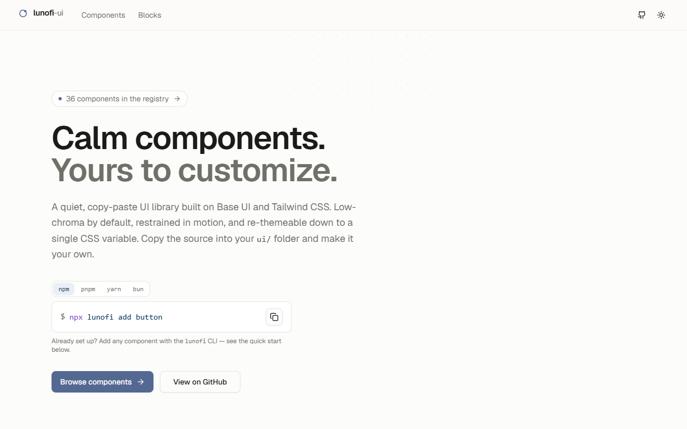
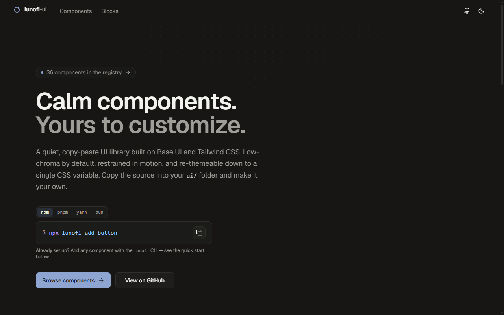
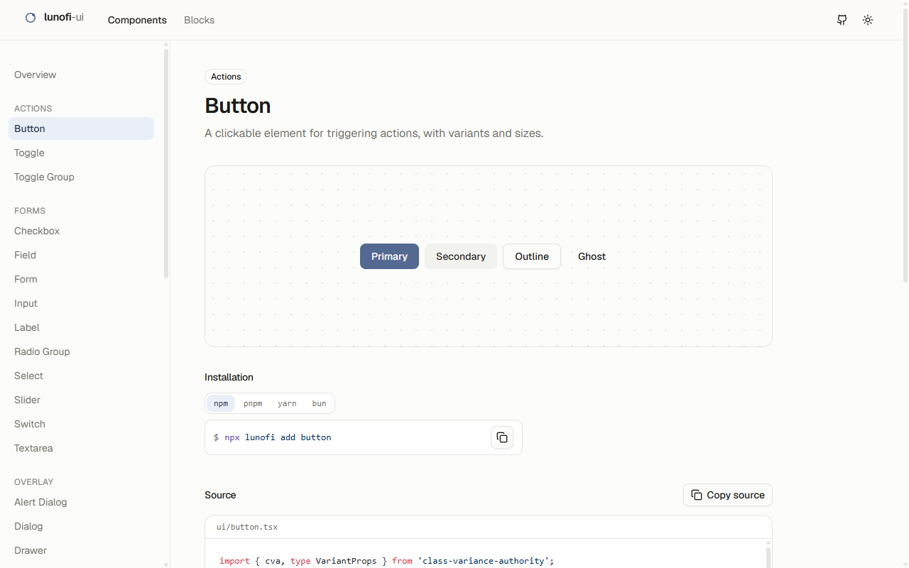

<div align="center">

# lunofi-ui

**Calm, customizable copy-paste UI components built on [Base UI](https://base-ui.com) and Tailwind CSS.**

Like shadcn/ui — you own the code. A CLI copies component source straight into your
project's `ui/` folder, and you re-theme everything through CSS variables. The defaults
are intentionally quiet: low-chroma color, restrained motion, and trivially overridable.

</div>

<p align="center">
  
</p>

<table>
  <tr>
    <td width="50%"></td>
    <td width="50%"></td>
  </tr>
</table>

---

> [!WARNING]
> **lunofi-ui is in early development and not yet ready for use in real projects.**
> APIs, component names, the theme tokens, the registry format, and the CLI are all still
> moving. Nothing is published to npm yet. Explore it, take ideas from it, open issues —
> but don't depend on it in production until there's a tagged release.

---

## What it is

- **36 components** built on [`@base-ui/react`](https://base-ui.com) primitives (not Radix) — dialogs, popovers, menus, tabs, selects, form controls, and more.
- **Calm by default.** A low-chroma OKLCH palette, a single `--radius`, restrained motion. Quiet out of the box, fully re-themeable through CSS variables.
- **You own the code.** Components are distributed as _source_, not as a runtime dependency — the CLI copies them into your `ui/` folder so you can read and edit everything.
- **Tailwind v4, CSS-first.** Theme tokens live in one place and override cleanly from your own stylesheet.
- **Storybook + tests.** Every component has a story; stories run as tests via the Storybook Vitest integration.

## Quick start

> Packages aren't published yet, so the commands below describe the intended flow rather than something you can run today.

```bash
# Set up your project (writes config + the calm theme + the cn() helper)
npx lunofi init

# Add components — source lands in your ui/ folder, deps install automatically
npx lunofi add button dialog tabs
```

The CLI supports npm, pnpm, yarn, and bun (`pnpm dlx lunofi …`, `bunx lunofi …`, etc.). Until
there's a release, browse the components and copy the source directly from the docs site.

## Monorepo layout

```
apps/
  web/              Landing page + live component showcase + registry host
packages/
  ui/               Component source (distributed via the registry, not published)
  tailwind/         Shared Tailwind v4 theme preset — the calm OKLCH tokens
  registry/         Zero-dependency registry build (powers the CLI + copy buttons)
  cli/              The `lunofi` install CLI (zero runtime dependencies)
  tsconfig/         Shared TypeScript configs
  eslint-config/    Shared ESLint flat configs
```

## Local development

Requires Node `>=22.22.1` and pnpm `10.x`.

```bash
pnpm install
pnpm build           # build all packages
pnpm lint            # lint everything
pnpm check-types     # typecheck everything
pnpm registry:build  # generate the registry JSON
```

Per-package tasks (Storybook, the web app, tests) are run with pnpm filters, e.g.
`pnpm --filter @lunofi/ui storybook`.

## Philosophy

- **Calm, not loud.** Good defaults are quiet; personality is something you add, not something you fight.
- **Own your components.** Copy-paste source beats a black-box dependency when you need to bend a component to your design.
- **Few dependencies.** The registry and CLI are built on Node built-ins; the component layer leans on Base UI and a couple of tiny utilities.

## Status

Built and working: the component library, the calm theme preset, the registry format and
build, the docs/showcase web app, the Storybook setup with tests, and the CLI. Still ahead:
publishing the packages, more components and blocks, and stabilizing the public APIs.

## Contributing

It's early — issues and ideas are welcome. Expect things to change.

## License

[MIT](./LICENSE)
